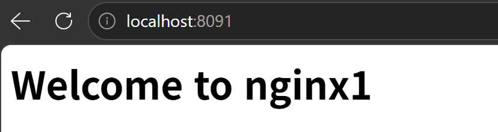
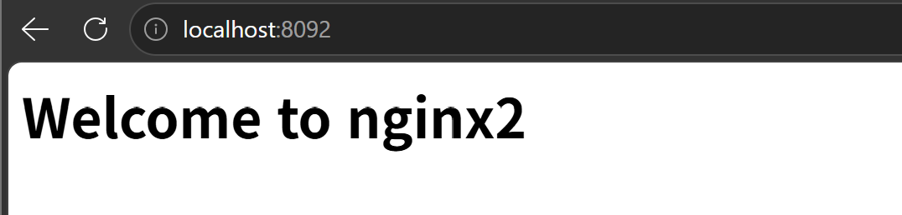
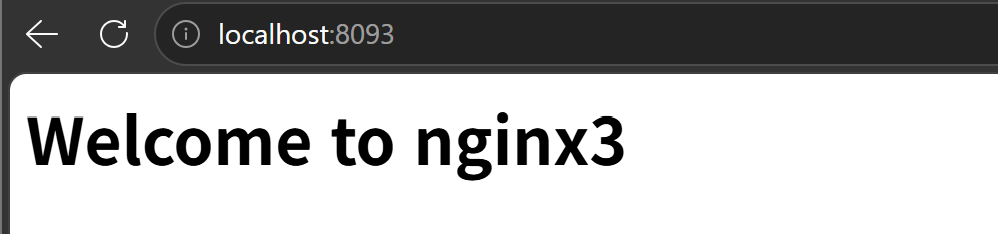
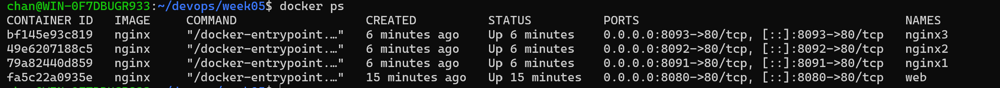

#5주차 - Docker

## curl로 세 페이지 확인 결과

### localhost:8091
```
$ curl -s http://localhost:8091
<h1>Welcome to nginx1</h1>
```

### localhost:8092
```
$ curl -s http://localhost:8092
<h1>Welcome to nginx2</h1>
```

### localhost:8093
```
$ curl -s http://localhost:8093
<h1>Welcome to nginx3</h1>
```

## 브라우저 확인 화면




## 브라우저 확인 화면


## 브라우저 확인 화면


EOF

cat >> README.md << 'EOF'

## 브라우저 확인 화면


## 브라우저 확인 화면


